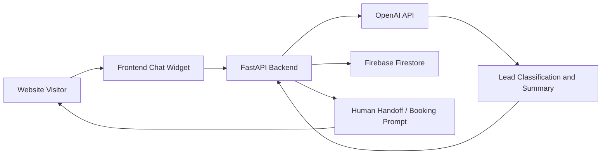

# Realtor AI Agent

## Overview

Realtor AI Agent is an in-progress AI application concept for real estate lead qualification, lead capture, and human handoff. The goal is to create a website chat experience that can classify prospective buyers, sellers, renters, and investors, collect structured lead details, summarize the conversation, and route the user toward a booking or human follow-up workflow.

At the moment, the repository contains project planning documentation rather than a completed codebase. The README is therefore written to describe the intended architecture and portfolio direction without claiming that backend, frontend, Firebase, or deployment work has already been completed.

Once implemented, the project can demonstrate practical AI application development with FastAPI, OpenAI API integration, Firebase Firestore, web UI development, structured extraction, and compliance-aware prompting for a regulated business domain.

## Planned Key Features

- Website chat interface for real estate inquiries.
- Buyer, seller, renter, and investor lead classification.
- Structured lead capture for contact details, timeline, budget, property type, and intent.
- AI-generated lead summaries for human review.
- Human handoff flow for qualified leads.
- Booking prompt flow for scheduling next steps.
- Firebase Firestore-backed lead storage.
- Compliance-aware prompting to avoid unsupported legal, financial, or fair-housing claims.
- Future admin dashboard for reviewing captured leads and summaries.

## Planned Architecture

The planned architecture uses a browser-based chat widget that communicates with a FastAPI backend. The backend sends user messages to an LLM for classification and structured extraction, stores lead records in Firestore, and returns the next assistant response or handoff prompt to the frontend.

## Tools & Technologies

### Cloud / Infrastructure

- Firebase Firestore
- Future deployment target to be determined

### AI / Application Tools

- OpenAI API
- Prompt design for lead qualification
- Structured extraction
- Compliance-aware response design

### Programming / Scripting

- Python
- FastAPI
- HTML
- CSS
- JavaScript

### Monitoring / Logging

- Planned backend request logging
- Planned lead capture audit trail
- Planned error logging for failed LLM or Firestore calls

### Automation / CI/CD

- GitHub repository for version control
- No CI/CD pipeline is currently implemented

## Security and AI Safety Concepts Demonstrated

This project is relevant to AI application security because real estate lead qualification involves user-provided personal information, domain-specific constraints, and a need for controlled model behavior. The project should account for prompt injection, data minimization, safe storage of lead details, and clear boundaries around what the AI assistant can and cannot say.

The compliance-aware prompting direction is important. A real estate assistant should avoid making unsupported claims, should not provide legal or financial advice, and should be careful around fair-housing-sensitive language. Those safeguards should be built into both prompts and backend validation.

## Planned Implementation Steps

1. Define lead qualification fields and conversation states.
2. Build the FastAPI backend scaffold.
3. Add a basic chat endpoint.
4. Build a browser chat widget with HTML, CSS, and JavaScript.
5. Integrate OpenAI API calls for classification and response generation.
6. Add structured extraction for lead details.
7. Store leads and summaries in Firebase Firestore.
8. Add a human handoff and booking prompt flow.
9. Add compliance-aware guardrails and refusal patterns.
10. Build an admin dashboard for reviewing captured leads.
11. Add deployment, logging, and monitoring.

## Current Status / Results

This repository is currently in the planning stage. It includes the project concept, target features, planned stack, and milestone outline, but it does not yet include the backend, frontend, Firestore integration, or deployed application code.

That is acceptable for an early portfolio project as long as it is labeled clearly. The repository now includes an AI safety and security plan so reviewers can see the intended controls before implementation begins.

## Evidence / Planning Artifacts

Current artifacts:

- `README.md`
- `docs/ai-safety-plan.md`
- `LICENSE`

## Challenges & Lessons Learned

- AI lead qualification needs structured output, not just conversational responses.
- Real estate workflows require careful compliance boundaries.
- User-provided contact and property data should be handled with privacy and retention controls.
- Prompt design should be paired with backend validation before saving or acting on lead data.
- A portfolio README should clearly separate planned work from implemented work.

## Relevance to Security and AI Roles

This project can become relevant to AI Engineer, AI Application Developer, Application Security Engineer, and Product Security roles once implemented. The strongest security angle is building an AI workflow that handles personal data safely, resists prompt injection, and keeps regulated-domain responses within appropriate boundaries.

It is also relevant to software engineering roles because it shows product thinking, backend API design, frontend UX planning, and database-backed workflow design.

## Future Improvements

- Add the FastAPI backend scaffold.
- Add the frontend chat widget.
- Implement OpenAI lead classification with structured JSON output.
- Add Firestore lead persistence.
- Add input validation and prompt injection tests.
- Add compliance guardrails and example refusal cases.
- Add a basic admin dashboard.
- Add deployment instructions and environment variable documentation.
- Add a short demo video once the app is working.
